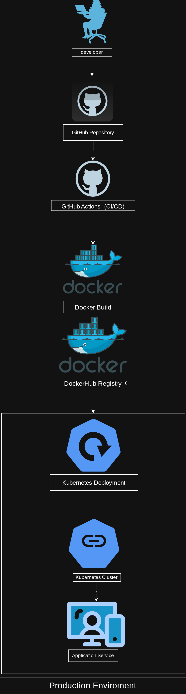

## DevOps Project - Docker + Kubernetes

---

# 📌 Sobre o Projeto

Este projeto demonstra um fluxo completo de DevOps moderno, utilizando containerização, integração contínua e orquestração de containers.

O objetivo é simular um pipeline utilizado em ambientes reais de empresas de tecnologia.

---

# 🏗 Arquitetura DevOps

Fluxo completo do projeto:

Developer → GitHub → GitHub Actions → Docker Build → DockerHub → Kubernetes Deploy → Application Running

---

# ⚙️ Tecnologias Utilizadas

* Docker  
* Kubernetes  
* GitHub Actions  
* DockerHub  
* Nginx  
* Linux  

---

# 🔄 Pipeline CI/CD

A pipeline automatiza todo o processo de build e deploy da aplicação.

Etapas executadas:

1. Checkout do código
2. Build da imagem Docker
3. Push da imagem para DockerHub
4. Deploy no Kubernetes

Tudo isso acontece automaticamente após um push no GitHub.

---

# 📦 Build da Imagem Docker

Para construir a imagem manualmente:

docker build -t santrhay/devops-app:latest -f docker/Dockerfile .

---

# 📤 Enviar Imagem para DockerHub

docker push santrhay/devops-app:latest

---

# 🚀 Deploy no Kubernetes

Aplicar os manifests Kubernetes:

kubectl apply -f k8s/deployment.yaml  
kubectl apply -f k8s/service.yaml  

---

# 📊 Estrutura do Projeto

devops-project

app  
└── index.html  

docker  
└── Dockerfile  

k8s  
├── deployment.yaml  
└── service.yaml  

.github  
└── workflows  
└── pipeline.yml  

README.md

---

# 📈 Objetivo do Projeto

Demonstrar conhecimentos práticos em:

* Containerização de aplicações  
* Automação de pipelines CI/CD  
* Build e publicação de imagens Docker  
* Orquestração com Kubernetes  
* Estrutura de projetos DevOps  

---

# 🎯 Resultados Obtidos

✔ Pipeline CI/CD automatizada  
✔ Build automático da imagem Docker  
✔ Publicação automática no DockerHub  
✔ Deploy em ambiente Kubernetes  

---

# 💻 Autor
Rayane Santana

Projeto desenvolvido para prática e estudo de DevOps e Cloud Engineering.

---

# ⭐ Contribuição

Sinta-se à vontade para abrir issues ou enviar pull requests com melhoria

## DevOps Architecture

This project demonstrates a complete DevOps pipeline using Docker, Kubernetes and CI/CD.

### Architecture Diagram

